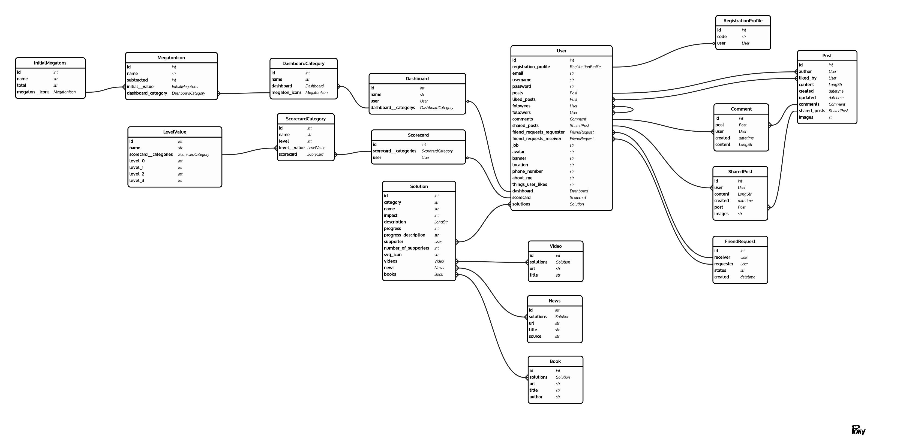

# Climate Cockpit

## Wireframe

https://www.figma.com/file/KMcmmUApmDXahwsdGtfjAA/

## Object Role Modeling

## Backend API Endpoints

### Registration

- `/auth/registration/` POST: Register new user by asking for email (a
  validation code will be sent to the given email)
- `/auth/registration/validation/` POST: Validate the creation of new user with
  the code sent by email

### Authentication

- `/auth/token/` POST: Get a new JWT by sending email and password
- `/auth/token/refresh/` POST: Get a new JWT by passing an old still valid
  refresh token
- `/auth/token/verify/` POST: Verify the validity of a token
- `/auth/password-reset/` POST: Reset a user’s password by sending a validation
  code in a email
- `/auth/password-reset/validation/` POST: Validate password the reset token and
  set new password for the user

### Posts

- `social/posts/` POST: The user can create a new post by sending post data.
  They should also be able to share another post. (Check out the frontend design
  to see how a shared post looks like.)
- `social/posts/` GET: List all the posts of all users in chronological order
- `social/posts/?search=<str:search_string>` GET: Search posts of all users and
  list result in chronological order
- `social/posts/<int:post_id>/` GET: Get a specific post by ID and display all
  the information about that post
- `social/posts/<int:post_id>/` PATCH: Update a specific post (allowed for owner
  of the post or an admin)
- `social/posts/<int:post_id>/` DELETE: Delete a post by ID (allowed for owner
  of the post or an admin)
- `social/posts/user/<int:user_id>/` GET: List all the posts of a specific user
  in chronological order
- `social/posts`/following/ GET: List all the posts of followed users in
  chronological order
- `social/posts/friends/` GET: List all the posts of the logged in user’s
  friends in chronological order
- `social/posts/toggle-like/<int:post_id>/` POST: Like/Unlike a post(should work
  like a toggle)
- `social/posts/likes/` GET: List the posts that the logged in user likes

### Comments

`social/comments/new/<int:post_id>/` POST: Create a new comment for a post
`social/comments/<int:comment_id>/` GET: Get a comment
`social/comments/<int:comment_id>/` DELETE: Delete a comment
`social/comments/<int:post_id>/` GET: List all comments of a post

### Users

- `users/me/` GET: Get logged in user’s profile (as well as private information
  like email, etc.)
- `users/me/` PATCH: Update the logged in user’s profile public info
- `users/me/` DELETE: Delete the logged in user’s profile and all related data
  (posts, comments, likes, etc.)

- `social/followers/toggle-follow/<int:user_id>/` POST: Toggle follow/unfollow a
  user
- `social/followers/followers/` GET: List of all the logged in user’s followers
- `social/followers/following/` GET: List of all the people the current logged
  in user is following
- `social/friends/request/<int:user_id>/` POST: Send friend request to another
  user
- `social/friends/requests/<int:friend_request_id>/` GET: Get details of a
  friend request
- `social/friends/requests/<int:friend_request_id>/` PATCH: Accept or Reject an
  open friend request(allowed for the recipient of the friend request or an
  admin)
- `social/friends/requests/<int:friend_request_id>/` DELETE: Delete a friend
  request(allowed for the sender of the friend request or an admin)
- `social/friends/` GET: List all accepted friends
- `users/` GET: Get all the users
- `users/?search=<str:search_string>` GET: Search users
- `users/<int:user_id>/` GET: Get a specific user’s profile
